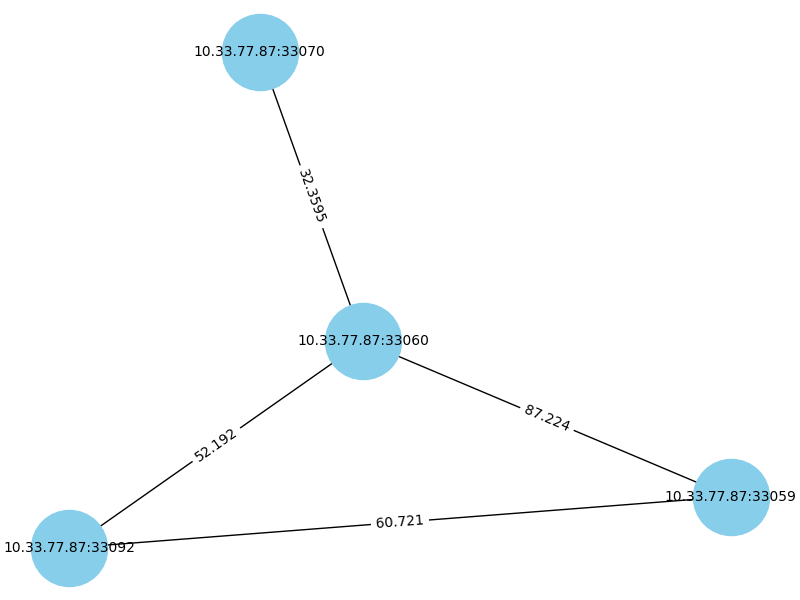

# Inital discovery idea: Satellite Topology (Deprecated)

## Introduction
This is the initial idea for satellite discovery. The idea is to use the satellite topology to discover the satellites. 
However, this idea is deprecated and not used in the final implementation. It is finally replaced by the idea of using 
blocklists due to this idea is hard to integrate with other functions in the protocol.

## Main Code Structure
The codes used for this function is structured as follows:
- `discovery.py`: This is the main file that contains the code for satellite discovery. It contains the code for 
  discovering the satellites, getting their neighbors, building the satellite topology and calculating the weight of the
  edges by load and latency.
- `satellite_utils.py`: This file contains the utility functions for satellite discovery including the functions for 
   getting the load and latency of the satellites, removing unreachable satellites and updating the satellite status.
- `update_satellite.py`: This file contains the code for updating the satellite topology dynamically with the changing IP 
   of satellites and neighbors, load and latency.
- `mock_satellite.py`: This file is for simulating a single satellite randomly giving a load and latency. The load, 
   latency can be assessed by `/id`.
- `comprehensive_simulation.py`: This file is for simulating multiple satellites and randomly assigning neighbors to 
   them. The neighbors can be assessed `/neighbors`. 

## How to Run
1. Install required packages by running the following command:
    ```bash
    pip install -r requirements.txt
    ```
2. Run the following command to make sure you are in the current directory:
    ```bash
    export PYTHONPATH=$(pwd)
    ```
3. In order to simulate multiple satellites, randomly adding and removing some of them and assigning neighbors to them, you can run the following command:
Note: you can change any number of satellites by changing the `--max_satellites` parameter.
    ```bash
    python3 comprehensive_simulation.py --max_satellites 5
    ```
4. In order to simulate topology update, you can run the following command (keep comprehensive_simulation.py running at the same time): 
   ```bash
   python3 update_satellite.py
   ```

## Output
### 1. topology visualization
This process will dynamically update visualization of the topology update every 10 seconds. Below is a possible example:

### 2. satellites_config.json
Dynamically update the satellites information including ip, port and neighbors, below is a possible example:
```json
{
    "satellites": [
        {
            "ip": "10.33.77.87",
            "port": 33092,
            "neighbors": [
                "10.33.77.87:33044",
                "10.33.77.87:33047"
            ]
        },
        {
            "ip": "10.33.77.87",
            "port": 33047,
            "neighbors": [
                "10.33.77.87:33092",
                "10.33.77.87:33001",
                "10.33.77.87:33044"
            ]
        },
        {
            "ip": "10.33.77.87",
            "port": 33001,
            "neighbors": [
                "10.33.77.87:33047",
                "10.33.77.87:33013",
                "10.33.77.87:33044"
            ]
        },
        {
            "ip": "10.33.77.87",
            "port": 33044,
            "neighbors": [
                "10.33.77.87:33092",
                "10.33.77.87:33047",
                "10.33.77.87:33001"
            ]
        },
        {
            "ip": "10.33.77.87",
            "port": 33013,
            "neighbors": [
                "10.33.77.87:33001"
            ]
        }
    ]
}
```
### 3. topology.pkl
Dynamically store the topology information including the weight of the edges.
### 4. result.csv
Dynamically update the satellites information including IPv4,IPv6,Response Time (ms),Is a Satellite?,Neighbors, below is
a possible example:
```table
IPv4,IPv6,Response Time (ms),Is a Satellite?,Neighbors
10.33.77.87,::ffff:10.33.77.87,0.14,True,"['10.33.77.87:33001', '10.33.77.87:33047']"
10.33.77.87,::ffff:10.33.77.87,0.119,True,['10.33.77.87:33001']
10.33.77.87,::ffff:10.33.77.87,0.235,True,"['10.33.77.87:33092', '10.33.77.87:33001']"
10.33.77.87,::ffff:10.33.77.87,0.092,True,"['10.33.77.87:33092', '10.33.77.87:33047', '10.33.77.87:33016']"
```
## loggings
1. you can check the simulation loggings about which nodes are added, removed, and updated in `simulation.log` file. Below is the possible example:
    ```bash
    2024-11-21 21:28:18,462 - WARNING - Configuration file not found, generating a new one.
    2024-11-21 21:28:18,462 - INFO - Added new satellite: 10.33.77.87:33010
    2024-11-21 21:28:18,465 - INFO - Mock Satellite started: 10.33.77.87:33010
    2024-11-21 21:28:18,466 - INFO - Neighbors of satellite 10.33.77.87:33010: []
    2024-11-21 21:28:18,466 - INFO - Configuration file saved: satellites_config.json
    2024-11-21 21:28:18,466 - INFO - Waiting 30 seconds before the next operation.
    2024-11-21 21:28:19,201 - INFO - WARNING: This is a development server. Do not use it in a production deployment. Use a production WSGI server instead.
     * Running on http://10.33.77.87:33010
    2024-11-21 21:28:19,201 - INFO - Press CTRL+C to quit
    2024-11-21 21:28:19,203 - INFO -  * Restarting with stat
    2024-11-21 21:28:19,641 - WARNING -  * Debugger is active!
    2024-11-21 21:28:19,661 - INFO -  * Debugger PIN: 129-773-529
    2024-11-21 21:28:48,473 - INFO - Configuration file loaded.
    2024-11-21 21:28:48,474 - INFO - Added new satellite: 10.33.77.87:33084
    2024-11-21 21:28:48,480 - INFO - Mock Satellite started: 10.33.77.87:33084
    2024-11-21 21:28:48,482 - INFO - Neighbors of satellite 10.33.77.87:33010: []
    2024-11-21 21:28:48,482 - INFO - Neighbors of satellite 10.33.77.87:33084: []
    2024-11-21 21:28:48,483 - INFO - Configuration file saved: satellites_config.json
    2024-11-21 21:28:48,483 - INFO - Waiting 16 seconds before the next operation.
    2024-11-21 21:28:49,244 - INFO - WARNING: This is a development server. Do not use it in a production deployment. Use a production WSGI server instead.
       * Running on http://10.33.77.87:33084
    ```
2. you can check the topology update log in `topology_log.txt` file. Below is the possible example:
    ```bash
   --- Topology state at 2024-11-21 21:30:21 ---


    --- Topology state at 2024-11-21 21:30:36 ---
    ('10.33.77.87:33010', '10.33.77.87:33059', {'weight': 49.918})
    ('10.33.77.87:33010', '10.33.77.87:33030', {'weight': 35.5375})
    ('10.33.77.87:33059', '10.33.77.87:33030', {'weight': 58.6515})
    
    
    --- Topology state at 2024-11-21 21:30:52 ---
    ('10.33.77.87:33010', '10.33.77.87:33059', {'weight': 49.918})
    ('10.33.77.87:33010', '10.33.77.87:33030', {'weight': 62.0065})
    ('10.33.77.87:33010', '10.33.77.87:33001', {'weight': 57.5685})
    ('10.33.77.87:33059', '10.33.77.87:33030', {'weight': 64.218})
    ('10.33.77.87:33030', '10.33.77.87:33001', {'weight': 62.635})
   ```

## Information check
1. Find a running satellite
2. Check the satellite information by accessing the `/id` endpoint. Below is the possible example (availiable if testing locally):
    ```bash
    curl http://10.33.77.87:33005/id
    ```
   and the possible output is:
    ```json
    {
     "data": "I am a satellite",
     "latency": 92.88,
     "load": 32 
    }
    ```
3. Check the neighbors of a satellite by accessing the `/neighbors` endpoint. Below is the possible example (avaliable if testing locally):
    ```bash
    curl http://10.33.77.87:33005/neighbors
    ```
    and the possible output is:
    ```json
     {
      "neighbors": [
        "10.33.77.87:33100",
        "10.33.77.87:33067"
      ]
    }
    ```
## Special Instructions running on Raspberry Pi
Due to the limitation of installing the packages on Raspberry Pi, you may need to comment out the visualization of 
topology in relevant files. This won't affect the functionality of the code and just not visualize the topology.

1. Comment out the following line in `discovery.py`:
   - line 8: 'import matplotlib.pyplot as plt'
   - line 141 - 153:
    ```python
       def visualize_topology(topology: nx.Graph, interval):
          """Visualize the satellite topology graph."""
          plt.figure(figsize=(8, 6))
          pos = nx.spring_layout(topology)
          nx.draw(topology, pos, with_labels=True, node_size=3000, node_color="skyblue", font_size=10)
      
          # Show edge weights
          edge_labels = nx.get_edge_attributes(topology, "weight")
          nx.draw_networkx_edge_labels(topology, pos, edge_labels=edge_labels)
      
          plt.title("Network Topology with Weights")
          plt.pause(interval)
          plt.close()
    ```
2. Make modifications to following line in `update_satellite.py`:
   - Line 9: change `from discovery import discover_satellites, build_topology, update_topology, visualize_topology` to 
     `discovery import discover_satellites, build_topology, update_topology`.
   - Line 105: Comment out visualize_topology(topology, interval=5)


